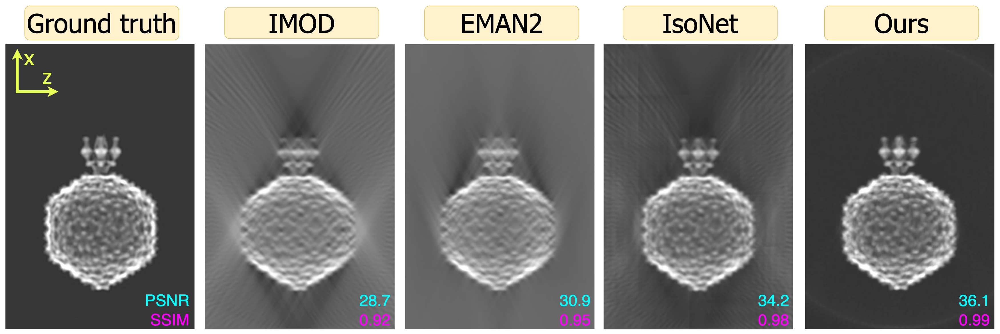

# WUCON: Wedge reconstruction with Unsupervised COordinate Networks | IJMS 2024 

Official implementation from Stanford University
- <b> Title: </b>[Missing Wedge Completion via Unsupervised Learning with Coordinate Networks](https://www.biorxiv.org/content/10.1101/2024.04.12.589090v2.full.pdf)<br>
- <b>Authors: </b>[Dave Van Veen](https://davevanveen.com/), Jesús G. Galaz-Montoya, Liyue Shen, Philip Baldwin, Akshay S. Chaudhari, Dmitry Lyumkis, Michael F. Schmid, Wah Chiu, John Pauly<br> 
- <b>Contact: </b>{vanveen, pauly} [at] stanford [dot] edu<br>



## Set-up

1. Clone the repository:
```
git clone https://github.com/davevanveen/wucon.git
cd wucon
```
2. Use these commands to set up a conda environment:
```
conda env create -f env.yml
conda activate wucon
```
3. In `src/constants.py`, create your own project directory `DIR_PROJECT` which will contain input data, trained models, and generated output.
    - Due to the large amount of data, it's recommended to create `DIR_PROJECT` outside this code repository to avoid pushing data to GitHub.
4. Download data from [this folder](https://drive.google.com/drive/folders/10gZ-o1J2sPu0npkq6nQXTxeJfrbbWNYt?usp=sharing) and set `DIR_DATA` in `src/constants.py` accordingly. More information on data is provided below. 
5. (optional) To add your own dataset, follow the format of example datasets.
6) Run `cd src; ./main.sh`, after you've made the bash script [executable](https://askubuntu.com/questions/229589/how-to-make-a-file-e-g-a-sh-script-executable-so-it-can-be-run-from-a-termi). 


## Usage

Below describes a subset of scripts within `src/`:

- `main.sh`: generates reconstructions for a particular `dataset` and set of `case_id`s.
    - `case_id` defines a set of experiment parameters. We recommend starting with the default, `case_id=0`. Then if you wish to modify parameters for your own experiments, see `cases` in `constants.py`.
    - Results will be saved in `{DIR_PROJECT}/out/{dataset}/c{case_id}`.
- `constants.py`: sets configs for paths, datasets, and experiments.
- `recon_volume.py`: reconstructs volume chunks in series or parallel, depending on GPU availability, by making individual calls to `recon_chunk.py`.

## Data
- We provide three datasets from our paper [here](https://drive.google.com/drive/folders/10gZ-o1J2sPu0npkq6nQXTxeJfrbbWNYt?usp=sharing).
    - `sph`: Spheres of various sizes
    - `geo`: Geometric shapes 
    - `p2s`: P22 simulated virus particle
- `wucon_data_all.zip` contains all three datasets. For convenience, we've provided a smaller file `wucon_data_p2s.zip` which contains only `p2s`. 
- Each dataset contains the following files:
    - `{dataset}_tgt.mrc`: 3D image volume ("target").
        - Note this is not relevant for experimentally-acquired datasets, as the ground-truth "target" data does not exist.
    - `{dataset}_prj.mrc`: two-dimensional projections of the 3D volume.
    - `tilt_angles.tlt`: angles at which the projections were generated.